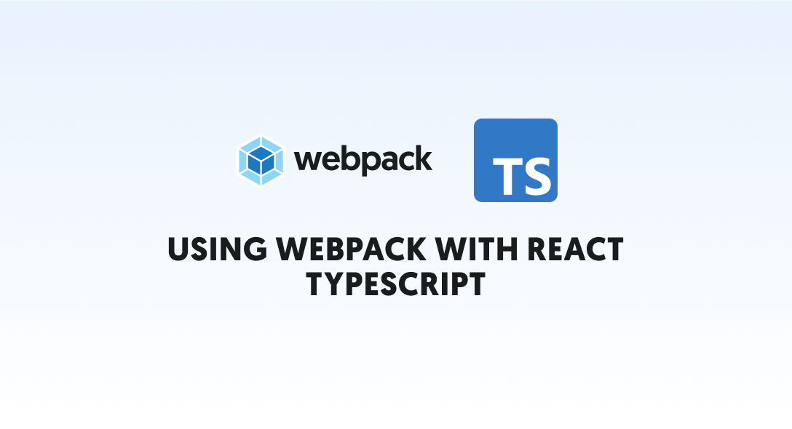

# Using Webpack with React Typescript

## Summary

## Learning goals

- Understand the role of webpack with React and Typescript and how we can set up our webpack.
- Set up a webpack with React and TypeScript.
- Use node module to set up to interact with client.

## What is Webpack?
Webpack is a free and open-source module bundler for JavaScript. It is made primarily for JavaScript, but it can transform front-end assets such as HTML, CSS, and images if the corresponding loaders are included.
Webpack takes modules with dependencies and generates static assets representing those modules.

Webpack takes the dependencies and generates a dependency graph allowing web developers to use a modular approach for their web application development purposes. It can be used from the command line or can be configured using a configuration file which is named webpack.config.js. This file defines rules, plugins, etc., for a project. (webpack is highly extensible via rules which allow developers to write custom tasks that they want to perform when bundling files together.)

Node.js is required for using webpack.
see more infomation https://webpack.js.org/

## What is React
React (also known as React.js or ReactJS) is a free and open-source front-end JavaScript library
for building user interfaces based on UI components. It is maintained by Meta (formerly Facebook) and a community 
of individual developers and companies. React can be used as a base in the development of single-page, mobile, 
or server-rendered applications with frameworks like Next.js. However, React is only concerned with state management and rendering that state to the DOM, 
so creating React applications usually requires the use of additional libraries for routing, as well as certain client-side functionality.
see more information https://reactjs.org/

## What is TypeScript
TypeScript is a programming language developed and maintained by Microsoft. It is a strict syntactical superset of JavaScript and adds optional static typing to the language. It is designed for the development of large applications and transpiles to JavaScript.
see more information https://www.typescriptlang.org/

## What will be the challenge?

We will be creating a website with using Webpack, React, TypeScript.

You do not need to modify any frontend code, only the backend, but feel free to look around if you are curious.
